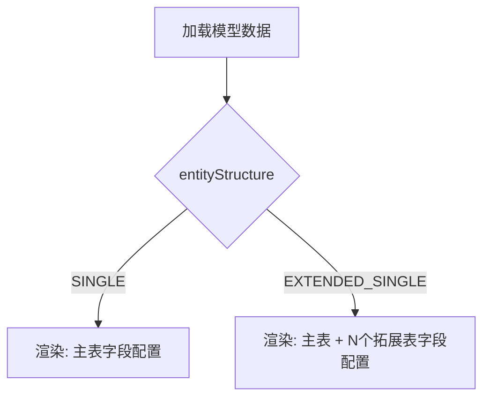
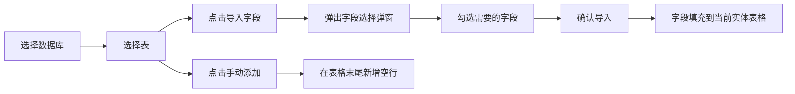

# 模型设计页面重构方案

## 1. 页面整体布局

页面从上到下分为三个区域：

```
┌──────────────────────────────────────────────────────┐
│  Header: 返回列表 | 模型设计 - {displayName}          │
├──────────────────────────────────────────────────────┤
│  模型基本信息 Card（可折叠，保留现有逻辑）              │
├──────────────────────────────────────────────────────┤
│  数据源选择区域                                        │
│  ┌─────────────────────────────────────────────────┐ │
│  │  数据库选择 → 表选择 → [导入字段] [手动添加字段]   │ │
│  └─────────────────────────────────────────────────┘ │
├──────────────────────────────────────────────────────┤
│  字段设计区域（根据模型关系动态渲染）                    │
│  ┌─────────────────────────────────────────────────┐ │
│  │  主表字段配置 Table                               │ │
│  ├─────────────────────────────────────────────────┤ │
│  │  拓展表1 字段配置 Table（EXTENDED_SINGLE 时）      │ │
│  │  拓展表2 字段配置 Table                           │ │
│  │  ...                                             │ │
│  ├─────────────────────────────────────────────────┤ │
│  │  子表1 字段配置 Table（MASTER_CHILD 时）           │ │
│  │  子表2 字段配置 Table                             │ │
│  │  ...                                             │ │
│  ├─────────────────────────────────────────────────┤ │
│  │  孙表1 字段配置 Table（MASTER_CHILD_GRANDCHILD 时）│ │
│  │  ...                                             │ │
│  └─────────────────────────────────────────────────┘ │
├──────────────────────────────────────────────────────┤
│  Footer: [保存配置]                                    │
└──────────────────────────────────────────────────────┘
```

## 2. 数据模型接口设计

### 2.1 字段配置接口

```typescript
/** 单个模型字段配置 */
export interface ModelField {
  /** 唯一标识 */
  id: string
  /** 字段名（小驼峰，可自定义） */
  fieldName: string
  /** 字段别名 */
  fieldAlias: string
  /** SQL 原始类型，如 VARCHAR(255) */
  rawType: string
  /** 映射后的 TS 类型，如 string / number / boolean / DateTime */
  tsType: string
  /** 默认值 */
  defaultValue: string
  /** 显示名称 */
  displayName: string
  /** 是否主键 */
  primaryKey: boolean
  /** 是否允许为空 */
  allowNull: boolean
  /** 字段注释 */
  comment: string
  /** 是否选中（从数据源导入时用） */
  selected: boolean
}

/** 实体字段配置（对应一个表/实体） */
export interface EntityFieldConfig {
  /** 实体标识，如 main / ext_0 / child_0 / grandchild_0 */
  entityKey: string
  /** 实体显示名称，如 主表 / 拓展表1 / 子表1 */
  entityName: string
  /** 关联的数据库表名（可选） */
  sourceTableName: string
  /** 字段列表 */
  fields: ModelField[]
}

/** 模型设计数据（持久化到 localStorage） */
export interface ModelDesignData {
  /** 模型 ID */
  modelId: string
  /** 选中的数据库名 */
  selectedDbName: string
  /** 选中的表名 */
  selectedTableName: string
  /** 各实体的字段配置 */
  entities: EntityFieldConfig[]
  /** 更新时间 */
  updateTime: string
}
```

### 2.2 SQL → TS 类型映射

```typescript
/** SQL rawType → TS 类型映射规则 */
export const SQL_TO_TS_MAP: Record<string, string> = {
  'VARCHAR': 'string',
  'BIGINT': 'string',   // BIGINT 值常超过 JS Number.MAX_SAFE_INTEGER，用 string 避免精度丢失
  'INT': 'number',
  'DECIMAL': 'number',
  'TINYINT': 'boolean',  // TINYINT(1) 特殊处理为 boolean
  'DATETIME': 'DateTime',
  'DATE': 'string',
  'TEXT': 'string',
}

/** TS 类型选项（用于手动创建字段时的下拉选择） */
export const TS_TYPE_OPTIONS = [
  { value: 'string', label: 'String 字符串' },
  { value: 'number', label: 'Number 数字' },
  { value: 'boolean', label: 'Boolean 布尔' },
  { value: 'DateTime', label: 'DateTime 日期时间' },
]
```

## 3. 组件架构

### 3.1 文件结构

```
src/views/meta-design/model-design/
├── index.tsx              # 页面主体
├── index.less             # 页面样式
├── types.ts               # 接口定义和常量
├── mock-data.ts           # 从 mock-config/table-fields-config.ts 提取数据
├── DataSourceSelector.tsx # 数据源选择组件
├── DataSourceSelector.less
├── FieldConfigTable.tsx   # 可编辑字段配置表格组件
└── FieldConfigTable.less
```

### 3.2 组件职责

#### DataSourceSelector

**功能**：数据库 → 表 → 字段选择的级联选择器

**Props**：
- `onFieldsImport: (fields: ModelField[], tableName: string) => void` — 导入字段回调

**交互流程**：
1. 选择数据库（从 mock-data 获取数据库列表）
2. 选择表（根据数据库筛选可用表）
3. 点击「导入字段」按钮 → 弹出字段选择弹窗（el-dialog + el-checkbox-group）
4. 勾选需要的字段 → 确认 → 调用 onFieldsImport 回调
5. 也可点击「手动添加字段」直接在表格中新增空行

#### FieldConfigTable

**功能**：可编辑的字段配置表格，支持增删改查

**Props**：
- `entityKey: string` — 实体标识
- `entityName: string` — 实体显示名称（如 主表、拓展表1）
- `fields: ModelField[]` — 字段列表（v-model）
- `onUpdate: (fields: ModelField[]) => void` — 字段更新回调
- `showImportButton: boolean` — 是否显示导入按钮
- `onImportClick: () => void` — 导入按钮点击回调

**表格列**：
| 列名 | 编辑方式 | 说明 |
|------|---------|------|
| 字段名 | el-input | 小驼峰格式，可自定义 |
| 字段别名 | el-input | 字段别名 |
| 原始类型 | el-input | SQL 类型，只读（从数据源导入时自动填充） |
| TS类型 | el-select | 从 TS_TYPE_OPTIONS 选择 |
| 默认值 | el-input | 默认值 |
| 显示名称 | el-input | 显示名称 |
| 注释 | el-input | 字段注释，只读 |
| 主键 | el-tag | 主键标记 |
| 操作 | button | 上移 / 下移 / 删除 |

**交互**：
- 点击「添加字段」在末尾新增空行
- 每行内联编辑（el-input / el-select）
- 支持拖拽排序（或上移/下移按钮）
- 支持删除行

## 4. 页面动态布局逻辑（第一阶段：单表 + 横向拓展单表）

> **注意**：第一阶段仅实现 SINGLE 和 EXTENDED_SINGLE 两种实体结构。
> MASTER_CHILD 和 MASTER_CHILD_GRANDCHILD 将在后续阶段添加。

根据模型的 `entityStructure` 决定渲染哪些 EntityFieldConfig：



### 实体数量计算

```typescript
function getEntityConfigs(model: StoredModel): EntityFieldConfig[] {
  const entities: EntityFieldConfig[] = []
  
  // 始终有主表
  entities.push({ entityKey: 'main', entityName: '主表', sourceTableName: '', fields: [] })
  
  if (model.entityStructure === 'EXTENDED_SINGLE') {
    for (let i = 0; i < model.extendedTableCount; i++) {
      entities.push({
        entityKey: `ext_${i}`,
        entityName: `拓展表${i + 1}`,
        sourceTableName: '',
        fields: [],
      })
    }
  }
  
  // TODO: 后续阶段添加 MASTER_CHILD 和 MASTER_CHILD_GRANDCHILD
  
  return entities
}
```

## 5. 数据源选择交互流程



### 字段选择弹窗

使用 `el-dialog` + `el-checkbox-group` 实现：

- 左侧显示表的所有字段列表
- 每个字段显示：字段名、类型、注释
- 勾选需要的字段
- 确认后自动转换为 `ModelField[]` 并填充到当前活跃的实体表格中
- 字段名自动转为小驼峰格式（如 `org_id` → `orgId`，`createdAt` 保持不变）

## 6. 持久化策略

在现有 `storage.ts` 中扩展：

- 新增 `DESIGN_STORAGE_KEY = 'meta-design:model-design'`
- 新增 `getModelDesign(modelId: string): ModelDesignData | null`
- 新增 `saveModelDesign(data: ModelDesignData): void`
- 新增 `deleteModelDesign(modelId: string): void`
- 页面加载时读取，字段变更时自动保存（debounce 500ms）

## 7. 实施步骤

1. **创建 `types.ts`** — 定义所有接口和常量
2. **创建 `mock-data.ts`** — 从 `mock-config/table-fields-config.ts` 提取数据库/表/字段数据，提供查询函数
3. **创建 `FieldConfigTable.tsx` + `.less`** — 可编辑字段配置表格组件
4. **创建 `DataSourceSelector.tsx` + `.less`** — 数据源选择组件（含字段选择弹窗）
5. **重写 `index.tsx`** — 页面主体，整合所有组件，根据模型关系动态渲染
6. **重写 `index.less`** — 页面样式
7. **更新 `storage.ts`** — 新增模型设计数据的 CRUD
8. **验证构建通过**

## 8. 关键技术要点

- **TSX 中 el-dialog slot**：使用 `{{ default: () => ..., footer: () => ... }}` 统一 slot 对象
- **TSX 中 v-model**：`v-model={value}` 或 `modelValue={value} onUpdate:modelValue={(val) => ...}`
- **el-table 内联编辑**：使用 `el-input` / `el-select` 直接放在 `el-table-column` 的 default slot 中
- **响应式数组更新**：使用 `splice` / `push` 等 Vue 响应式数组方法
- **字段名小驼峰转换**：`rawName.replace(/_([a-z])/g, (_, c) => c.toUpperCase())`
