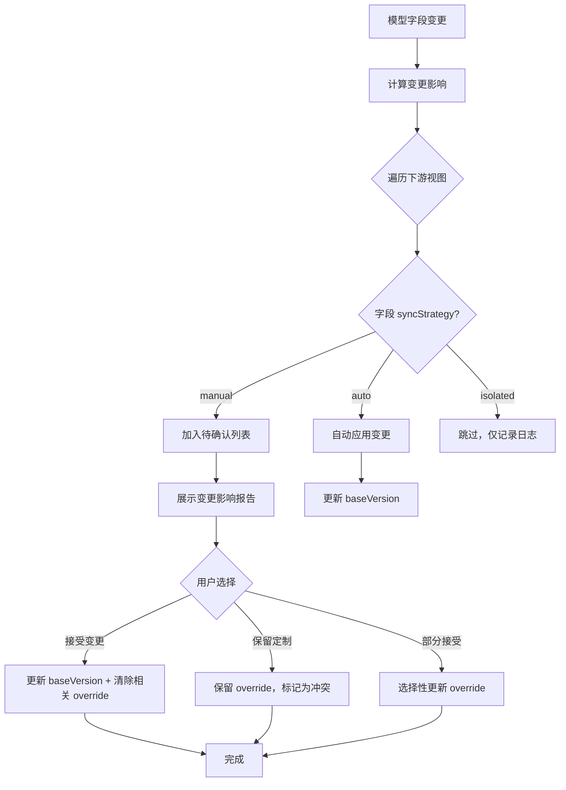
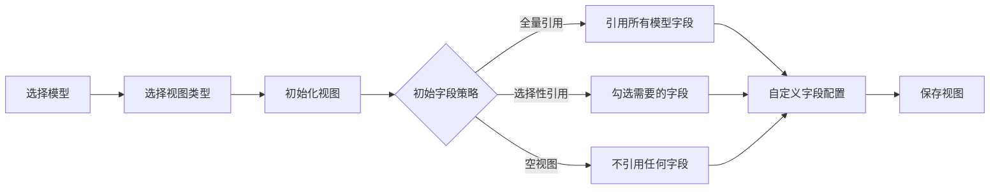
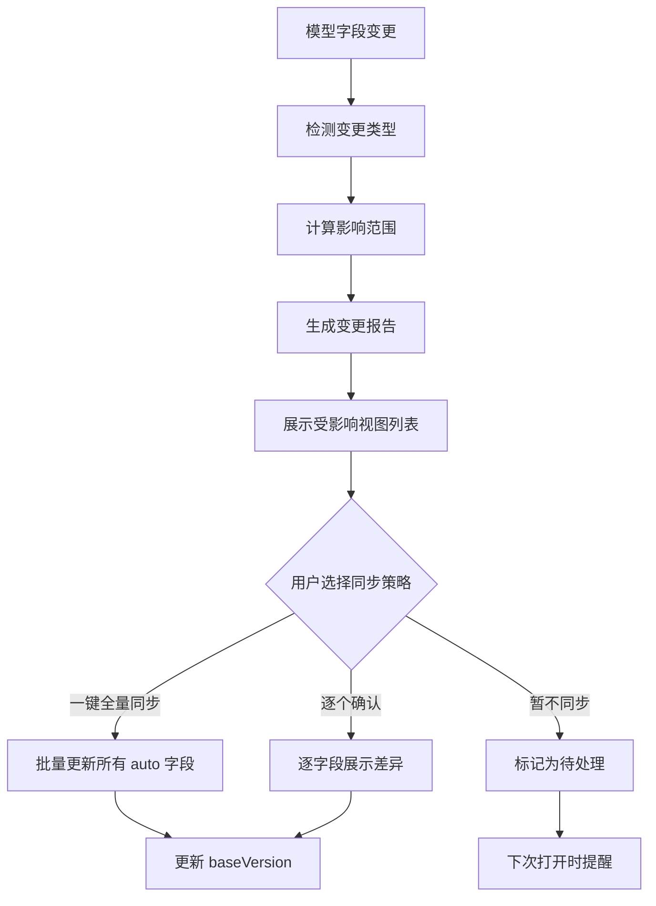

# 模型下游引用耦合 — 深度分析与方案设计

## 1. 问题定义

### 1.1 核心痛点

当前系统存在一个典型问题：**同一个模型被多个下游组件（表单、表格、详情、打印、导出）引用，但各组件的定制化修改无法协同管理**。

具体表现：
- 表单中删除了某字段，但详情展示和打印模板中该字段仍然存在
- 表单修改了字段 label，但打印和详情页面需要单独手动修改
- 模型新增字段后，需要逐个去下游组件手动添加
- 模型字段改名后，下游绑定断裂或需要逐个同步

### 1.2 问题本质

这是一个 **Schema Evolution + View Materialization** 问题，本质是：

> **如何让「单一数据源（模型）」的变更，安全、可控地传播到「多个差异化消费者（下游组件）」？**

---

## 2. 行业方案分析

### 2.1 方案对比矩阵

| 方案 | 代表产品/技术 | 核心思路 | 优点 | 缺点 | 适用场景 |
|------|-------------|---------|------|------|---------|
| **快照拷贝** | 传统低代码平台 | 下游完整拷贝模型数据 | 简单、独立、无运行时依赖 | 漂移严重、同步成本高 | 简单场景、一次性配置 |
| **实时引用** | JSON Schema $ref | 下游仅存引用，运行时合并 | 零漂移、自动同步 | 运行时开销、无法离线 | API Schema、配置管理 |
| **Delta Overlay** | CSS Cascade、GraphQL | 仅存差异，运行时叠加 | 精准、可追踪 | 合并逻辑复杂 | 样式系统、API 组合 |
| **版本化快照** | npm semver、Protobuf | 快照 + 版本号，按需升级 | 兼顾独立性和可控升级 | 存储冗余、升级策略复杂 | 包管理、数据序列化 |
| **事件驱动** | Database CDC | 监听变更事件，异步通知 | 解耦彻底、可扩展 | 一致性延迟、复杂度高 | 微服务、数据管道 |
| **混合方案** | Figma组件+实例 | 快照+字段级链接+选择性同步 | 兼顾性能和可控性 | 实现复杂度中等 | **推荐方案** |


### 2.2 关键行业案例

#### Figma 的组件-实例模型

Figma 的 Component → Instance 机制与我们的场景高度相似：

- **Component** = 模型（定义字段结构）
- **Instance** = 下游组件（表单、表格、详情等）
- **Override** = 下游对字段的定制（改 label、隐藏字段等）

Figma 的核心设计：
1. 每个 Instance 记录对 Component 属性的 **Override**（仅差异）
2. Component 更新时，未 Override 的属性自动同步
3. 已 Override 的属性保留定制值，但标记为「已覆盖」
4. 用户可选择「Reset Override」恢复为 Component 原值

#### Protocol Buffers 的 Schema Evolution

Protobuf 通过 **field number** 实现稳定引用：
- 字段名可以改，但 field number 永远不变
- 新增字段是向后兼容的（旧代码忽略新字段）
- 删除字段标记为 `reserved`，防止编号复用

#### CSS Cascade Layers

CSS 的级联机制提供了很好的类比：
- 基础层（模型定义）→ 组件层（表单/表格定制）→ 实例层（单次使用）
- 高层可以覆盖低层，但低层变更自动传播到未被覆盖的部分

---

## 3. 推荐方案：字段级链接 + 选择性同步

### 3.1 核心设计理念

```
模型（Model）── 定义字段 ──┐
                            │  字段级链接（fieldRef）
                            ▼
下游视图（View）── 仅存储差异 ──→ 运行时合并 → 完整视图
```

**核心原则**：
1. **下游不存完整拷贝**，仅存「引用 + 差异」
2. **字段通过稳定 ID 关联**，而非字段名
3. **模型变更有三种传播策略**，用户可按字段选择
4. **提供变更影响报告**，让用户知情决策

### 3.2 数据模型设计

#### 3.2.1 模型字段（不变）

```typescript
interface ModelField {
  id: string              // 稳定唯一标识，永不改变
  fieldName: string       // 字段名（可改名，不影响引用）
  fieldAlias: string      // 别名
  rawType: string         // SQL 类型
  tsType: string          // TS 类型
  displayName: string     // 显示名称
  defaultValue: string    // 默认值
  primaryKey: boolean     // 是否主键
  comment: string         // 注释
  source: 'database' | 'manual'  // 来源
  version: number         // 字段版本号，每次变更递增
}
```

#### 3.2.2 下游视图配置（新增）

```typescript
/** 下游视图类型 */
type ViewType = 'form' | 'table' | 'detail' | 'filter' | 'export' | 'print'

/** 字段同步策略 */
type SyncStrategy = 
  | 'auto'      // 自动同步：模型变更直接覆盖下游
  | 'manual'    // 手动同步：模型变更仅提示，用户决定是否同步
  | 'isolated'  // 隔离：模型变更不影响下游

/** 单个字段的引用配置 */
interface FieldRefConfig {
  /** 引用的模型字段 ID（稳定链接） */
  modelFieldId: string
  
  /** 同步策略 */
  syncStrategy: SyncStrategy
  
  /** 该引用基于的模型字段版本（用于变更检测） */
  baseVersion: number
  
  /** ===== 以下为「覆盖值」，null 表示使用模型原值 ===== */
  
  /** 覆盖显示名称，null 表示继承模型 */
  overrideDisplayName: string | null
  
  /** 覆盖默认值 */
  overrideDefaultValue: string | null
  
  /** 覆盖 TS 类型 */
  overrideTsType: string | null
  
  /** 覆盖是否必填 */
  overrideRequired: boolean | null
  
  /** 覆盖是否可见 */
  overrideVisible: boolean | null
  
  /** 覆盖只读状态 */
  overrideReadOnly: boolean | null
  
  /** 组件特有扩展属性（如表单的 inputType、表格的 columnWidth） */
  extensionProps: Record<string, any> | null
}

/** 下游视图定义 */
interface ModelView {
  id: string
  name: string                    // 视图名称，如「订单编辑表单」
  viewType: ViewType              // 视图类型
  modelId: string                 // 引用的模型 ID
  
  /** 字段引用配置列表 */
  fieldRefs: FieldRefConfig[]
  
  /** 新增的本地字段（模型中不存在的） */
  localFields: LocalField[]
  
  /** 字段排序（存储 fieldId 数组，包含 modelFieldId 和 localFieldId） */
  fieldOrder: string[]
  
  /** 最后同步的模型版本号 */
  syncedModelVersion: number
  
  /** 创建时间 */
  createdAt: number
  /** 更新时间 */
  updatedAt: number
}

/** 本地新增字段（仅存在于当前视图） */
interface LocalField {
  id: string
  fieldName: string
  displayName: string
  tsType: string
  defaultValue: string
  required: boolean
  visible: boolean
  comment: string
  extensionProps: Record<string, any> | null
}
```

### 3.3 运行时视图合并算法

```
┌─────────────┐     ┌──────────────┐     ┌──────────────┐
│  模型字段     │     │  FieldRef     │     │  合并结果     │
│  (base)      │────▶│  (override)  │────▶│  (resolved)  │
└─────────────┘     └──────────────┘     └──────────────┘

合并规则：
  overrideXxx !== null  →  使用 overrideXxx
  overrideXxx === null  →  使用模型原始值
```

```typescript
function resolveViewFields(model: Model, view: ModelView): ResolvedField[] {
  const modelFieldMap = new Map(model.fields.map(f => [f.id, f]))
  
  const resolvedFields: ResolvedField[] = []
  
  // 1. 处理引用字段
  for (const ref of view.fieldRefs) {
    const baseField = modelFieldMap.get(ref.modelFieldId)
    if (!baseField) {
      // 模型字段已被删除 → 标记为孤儿引用
      resolvedFields.push({
        status: 'orphaned',  // 模型中已不存在
        ref,
        baseField: null,
      })
      continue
    }
    
    resolvedFields.push({
      status: ref.baseVersion < baseField.version ? 'outdated' : 'synced',
      ref,
      baseField,
      // 合并：override 优先，否则用 base
      resolved: {
        fieldName: baseField.fieldName,
        displayName: ref.overrideDisplayName ?? baseField.displayName,
        tsType: ref.overrideTsType ?? baseField.tsType,
        defaultValue: ref.overrideDefaultValue ?? baseField.defaultValue,
        required: ref.overrideRequired ?? false,
        visible: ref.overrideVisible ?? true,
        readOnly: ref.overrideReadOnly ?? false,
        ...ref.extensionProps,
      }
    })
  }
  
  // 2. 处理本地新增字段
  for (const local of view.localFields) {
    resolvedFields.push({
      status: 'local',
      localField: local,
      resolved: local,
    })
  }
  
  // 3. 检测模型中新增但视图中未引用的字段
  const refFieldIds = new Set(view.fieldRefs.map(r => r.modelFieldId))
  for (const field of model.fields) {
    if (!refFieldIds.has(field.id)) {
      resolvedFields.push({
        status: 'unreferenced',  // 模型新增字段，视图尚未引用
        baseField: field,
      })
    }
  }
  
  // 4. 按 fieldOrder 排序
  return sortByOrder(resolvedFields, view.fieldOrder)
}
```

### 3.4 变更检测与影响分析

当模型字段发生变更时，系统自动分析影响：

```typescript
interface ChangeImpact {
  modelFieldId: string
  changeType: 'added' | 'removed' | 'renamed' | 'typeChanged' | 'propertyChanged'
  
  /** 受影响的视图列表 */
  affectedViews: Array<{
    viewId: string
    viewName: string
    viewType: ViewType
    impactLevel: 'breaking' | 'warning' | 'info'
    description: string
    hasOverride: boolean  // 下游是否有覆盖
    autoSyncSafe: boolean // 自动同步是否安全
  }>
}
```

#### 变更类型与影响等级

| 变更类型 | 影响等级 | 说明 |
|---------|---------|------|
| 新增字段 | info | 下游自动出现新字段引用提示 |
| 删除字段 | breaking | 下游引用断裂，必须处理 |
| 字段改名 | warning | 通过 ID 引用不受影响，但显示名可能需要同步 |
| 类型变更 | breaking/warning | 取决于类型兼容性 |
| 属性修改 | warning | displayName、defaultValue 等变更 |

---

## 4. 模型升级策略设计

### 4.1 四种升级策略

当模型发生变更时，下游视图的升级策略：

#### 策略一：自动同步（Auto Sync）

```
模型变更 → 自动传播到所有 syncStrategy='auto' 的字段引用
适用：团队内部、变更可控、信任模型维护者
```

#### 策略二：确认同步（Confirm Sync）

```
模型变更 → 生成变更报告 → 用户逐项确认 → 批量应用
适用：跨团队、需要审核、变更影响较大
```

#### 策略三：选择性同步（Cherry-pick Sync）

```
模型变更 → 展示差异列表 → 用户选择哪些同步、哪些忽略
适用：下游有强定制需求、不能全量同步
```

#### 策略四：版本锁定（Version Lock）

```
模型变更 → 下游不自动感知 → 用户手动触发「检查更新」
适用：稳定版本、不希望被模型变更打扰
```

### 4.2 升级流程



### 4.3 具体变更场景处理

#### 场景1：模型新增字段

```
操作：模型新增了 remark 字段
影响：所有下游视图出现 unreferenced 提示
处理：
  - auto 策略：自动添加引用，默认可见
  - manual 策略：提示用户，由用户决定是否添加到视图
  - isolated 策略：不提示，用户手动发现
```

#### 场景2：模型删除字段

```
操作：模型删除了 status 字段
影响：引用该字段的下游视图出现 orphaned 状态
处理：
  - 所有策略都必须处理（breaking change）
  - 提示用户：删除引用 or 转为 localField（保留但脱离模型）
```

#### 场景3：模型字段改名

```
操作：模型将 amount 改名为 totalAmount
影响：由于通过 ID 引用，绑定不受影响
处理：
  - auto 策略：fieldName 自动更新
  - manual 策略：提示用户确认
  - 如果下游有 overrideDisplayName，则不受影响
```

#### 场景4：模型字段类型变更

```
操作：模型将 amount 从 number 改为 string
影响：类型兼容性检查
处理：
  - 兼容变更（number→string）：warning 级别
  - 不兼容变更（string→boolean）：breaking 级别
  - 如果下游有 overrideTsType，检查是否与新模式兼容
```

#### 场景5：模型修改 displayName

```
操作：模型将 amount 的 displayName 从 金额 改为 订单金额
影响：
  - 下游未覆盖 displayName → 自动同步（auto）或提示同步（manual）
  - 下游已覆盖 displayName → 保留定制，仅提示模型侧有变更
```

---

## 5. 存储方案对比

### 5.1 方案A：下游独立完整拷贝

```
┌──────────┐     ┌──────────┐     ┌──────────┐     ┌──────────┐
│  模型     │     │ 表单视图  │     │ 表格视图  │     │ 详情视图  │
│ orderNo  │     │ orderNo  │     │ orderNo  │     │ orderNo  │
│ amount   │     │ amount   │     │ amount   │     │ amount   │
│ status   │     │ status   │     │ (deleted)│     │ status   │
│          │     │ +confirm │     │          │     │          │
└──────────┘     └──────────┘     └──────────┘     └──────────┘
                  完整独立拷贝      完整独立拷贝      完整独立拷贝
```

**优点**：
- 实现最简单
- 每个视图完全独立，互不影响
- 无运行时合并开销

**缺点**：
- 模型变更需逐个手动同步所有视图
- 极易产生漂移（各视图版本不一致）
- 存储冗余
- **无法解决当前痛点**

### 5.2 方案B：纯实时引用（无拷贝）

```
┌──────────┐
│  模型     │◄──── 表单视图仅存 [引用模型ID + 差异配置]
│ orderNo  │◄──── 表格视图仅存 [引用模型ID + 差异配置]
│ amount   │◄──── 详情视图仅存 [引用模型ID + 差异配置]
│ status   │
└──────────┘
运行时动态合并
```

**优点**：
- 零漂移，模型变更实时反映
- 存储最小化
- 单一数据源

**缺点**：
- 运行时合并有性能开销
- 无法离线使用
- 模型变更可能破坏下游（缺乏缓冲区）
- 所有下游必须在线

### 5.3 方案C：字段级链接 + 选择性同步（推荐）

```
┌──────────┐          ┌─────────────────────────────────────┐
│  模型     │          │ 表单视图                             │
│ orderNo  │◄─ID链接──│ orderNo: {sync:auto, override:null} │
│ amount   │◄─ID链接──│ amount:  {sync:auto, override:      │
│ status   │◄─ID链接──│   displayName:订单金额-元}           │
│          │          │ status:  {sync:manual, hidden:true}  │
│          │          │ +confirmAmount: {local}              │
└──────────┘          └─────────────────────────────────────┘
```

**优点**：
- 模型变更可控传播
- 仅存差异，存储精简
- 字段级同步策略，灵活可控
- 变更影响可追踪
- **能解决当前痛点**

**缺点**：
- 实现复杂度中等
- 需要变更检测和合并逻辑

### 5.4 方案对比总结

| 维度 | 方案A 完整拷贝 | 方案B 纯引用 | 方案C 字段级链接 |
|------|:---:|:---:|:---:|
| 实现复杂度 | ★☆☆ | ★★☆ | ★★★ |
| 模型变更同步 | 手动 | 自动 | 可选 |
| 数据一致性 | 差 | 好 | 好 |
| 离线能力 | 好 | 差 | 好 |
| 灵活性 | 高 | 低 | 高 |
| 变更影响追踪 | 无 | 无 | 有 |
| 冲突检测 | 无 | 无 | 有 |
| **推荐度** | ❌ | △ | ✅ |

---

## 6. 典型场景工作流

### 6.1 创建下游视图



### 6.2 模型变更 → 下游同步



### 6.3 解决当前痛点

**痛点1：表单删除字段，详情/打印仍存在**

解决：表单视图设置 `overrideVisible: false`（逻辑删除），而非物理删除引用。模型字段仍然存在，详情和打印视图可以继续引用。如果确实要全局删除，应在模型层面操作。

**痛点2：表单修改 label，详情/打印需单独修改**

解决：
- 如果所有视图都应统一 label → 在模型层面修改 displayName，auto 策略自动同步
- 如果仅表单需要不同 label → 表单视图设置 `overrideDisplayName`，其他视图继承模型原值
- 修改模型 displayName 后，未覆盖的视图自动同步，已覆盖的视图保留定制

**痛点3：模型新增字段需逐个添加**

解决：auto 策略的视图自动出现新字段引用；manual 策略的视图提示用户确认。

---

## 7. 与现有需求文档的映射

| 需求编号 | 需求描述 | 对应方案 |
|---------|---------|---------|
| 3.4.1 | 依赖关系记录 | `ModelView.modelId` + `FieldRefConfig.modelFieldId` 自动记录引用关系 |
| 3.4.2 | 强耦合/低耦合 | `SyncStrategy`: auto=强耦合, manual=中耦合, isolated=低耦合 |
| 3.4.3 | 变更影响分析 | `ChangeImpact` + `resolveViewFields()` 变更检测算法 |
| 3.5.1 | 继承能力 | `FieldRefConfig` 的 override 机制 + `LocalField` 新增字段 |
| 3.5.2 | 字段冲突处理 | 合并时检测类型兼容性，提供三种冲突策略 |
| 3.5.3 | 继承视图 | `resolveViewFields()` 运行时合并生成完整视图 |

---

## 8. 模拟示例：订单模型的下游引用场景

以一个「采购订单」模型为例，展示三种下游组件（表单、表格、打印）如何引用同一个模型，以及模型变更时各组件的行为差异。

### 8.1 基础模型定义

```typescript
// ===== 采购订单模型 =====
const purchaseOrderModel = {
  id: 'model_po_001',
  name: '采购订单',
  fields: [
    { id: 'f001', fieldName: 'orderNo',      displayName: '订单编号',   tsType: 'string',  defaultValue: '',  required: true,  primaryKey: true,  version: 1 },
    { id: 'f002', fieldName: 'supplierName',  displayName: '供应商名称', tsType: 'string',  defaultValue: '',  required: true,  primaryKey: false, version: 1 },
    { id: 'f003', fieldName: 'orderDate',     displayName: '订单日期',   tsType: 'string',  defaultValue: '',  required: true,  primaryKey: false, version: 1 },
    { id: 'f004', fieldName: 'totalAmount',   displayName: '总金额',     tsType: 'number',  defaultValue: '0', required: true,  primaryKey: false, version: 1 },
    { id: 'f005', fieldName: 'status',        displayName: '订单状态',   tsType: 'string',  defaultValue: 'draft', required: false, primaryKey: false, version: 1 },
    { id: 'f006', fieldName: 'remark',        displayName: '备注',       tsType: 'string',  defaultValue: '',  required: false, primaryKey: false, version: 1 },
    { id: 'f007', fieldName: 'createBy',      displayName: '创建人',     tsType: 'string',  defaultValue: '',  required: false, primaryKey: false, version: 1 },
    { id: 'f008', fieldName: 'createDate',    displayName: '创建时间',   tsType: 'string',  defaultValue: '',  required: false, primaryKey: false, version: 1 },
  ]
}
```

### 8.2 下游组件一：采购订单编辑表单

表单需要：隐藏创建人和创建时间（系统自动填充）、修改总金额的显示名、新增一个确认金额字段用于二次校验。

```typescript
// ===== 采购订单编辑表单（下游视图） =====
const formView = {
  id: 'view_form_po_001',
  name: '采购订单编辑表单',
  viewType: 'form',               // 表单类型
  modelId: 'model_po_001',        // 引用采购订单模型

  fieldRefs: [
    // orderNo — 完全继承模型，自动同步
    { modelFieldId: 'f001', syncStrategy: 'auto',  baseVersion: 1,
      overrideDisplayName: null, overrideVisible: null, overrideRequired: null },

    // supplierName — 完全继承模型
    { modelFieldId: 'f002', syncStrategy: 'auto',  baseVersion: 1,
      overrideDisplayName: null, overrideVisible: null, overrideRequired: null },

    // orderDate — 完全继承模型
    { modelFieldId: 'f003', syncStrategy: 'auto',  baseVersion: 1,
      overrideDisplayName: null, overrideVisible: null, overrideRequired: null },

    // totalAmount — 覆盖显示名为「订单金额（元）」
    { modelFieldId: 'f004', syncStrategy: 'auto',  baseVersion: 1,
      overrideDisplayName: '订单金额（元）', overrideVisible: null, overrideRequired: null },

    // status — 表单中隐藏（新增订单时不需要手动填状态）
    { modelFieldId: 'f005', syncStrategy: 'manual', baseVersion: 1,
      overrideDisplayName: null, overrideVisible: false, overrideRequired: null },

    // remark — 完全继承模型
    { modelFieldId: 'f006', syncStrategy: 'auto',  baseVersion: 1,
      overrideDisplayName: null, overrideVisible: null, overrideRequired: null },

    // createBy — 表单中隐藏（系统自动填充）
    { modelFieldId: 'f007', syncStrategy: 'manual', baseVersion: 1,
      overrideDisplayName: null, overrideVisible: false, overrideRequired: null },

    // createDate — 表单中隐藏（系统自动填充）
    { modelFieldId: 'f008', syncStrategy: 'manual', baseVersion: 1,
      overrideDisplayName: null, overrideVisible: false, overrideRequired: null },
  ],

  // 表单本地新增字段（模型中不存在）
  localFields: [
    { id: 'lf001', fieldName: 'confirmAmount', displayName: '确认金额（元）',
      tsType: 'number', required: true, visible: true,
      comment: '用于二次校验，确保金额输入正确' },
  ],

  // 字段排列顺序
  fieldOrder: ['f001', 'f002', 'f003', 'f004', 'lf001', 'f006'],
  // 注意：f005/f007/f008 虽然被引用但 visible=false，不出现在排序中
}
```

**表单渲染结果（运行时合并后）**：

| 字段 | 显示名称 | 类型 | 必填 | 可见 | 来源 |
|------|---------|------|------|------|------|
| orderNo | 订单编号 | string | ✅ | ✅ | 模型继承 |
| supplierName | 供应商名称 | string | ✅ | ✅ | 模型继承 |
| orderDate | 订单日期 | string | ✅ | ✅ | 模型继承 |
| totalAmount | **订单金额（元）** | number | ✅ | ✅ | 模型 + override displayName |
| confirmAmount | 确认金额（元） | number | ✅ | ✅ | **本地新增** |
| remark | 备注 | string | ❌ | ✅ | 模型继承 |
| ~~status~~ | — | — | — | ❌隐藏 | 模型 + override visible |
| ~~createBy~~ | — | — | — | ❌隐藏 | 模型 + override visible |
| ~~createDate~~ | — | — | — | ❌隐藏 | 模型 + override visible |

### 8.3 下游组件二：采购订单列表表格

表格需要：隐藏备注字段、修改订单编号列宽、新增操作列。

```typescript
// ===== 采购订单列表表格（下游视图） =====
const tableView = {
  id: 'view_table_po_001',
  name: '采购订单列表',
  viewType: 'table',              // 表格类型
  modelId: 'model_po_001',        // 引用同一模型

  fieldRefs: [
    // orderNo — 覆盖扩展属性：列宽 180px
    { modelFieldId: 'f001', syncStrategy: 'auto', baseVersion: 1,
      overrideDisplayName: null,
      extensionProps: { columnWidth: 180, sortable: true } },

    // supplierName — 继承模型
    { modelFieldId: 'f002', syncStrategy: 'auto', baseVersion: 1,
      overrideDisplayName: null,
      extensionProps: { columnWidth: 200 } },

    // orderDate — 继承模型
    { modelFieldId: 'f003', syncStrategy: 'auto', baseVersion: 1,
      overrideDisplayName: null,
      extensionProps: { columnWidth: 120, sortable: true } },

    // totalAmount — 继承模型
    { modelFieldId: 'f004', syncStrategy: 'auto', baseVersion: 1,
      overrideDisplayName: null,
      extensionProps: { columnWidth: 120, align: 'right' } },

    // status — 表格中需要展示状态
    { modelFieldId: 'f005', syncStrategy: 'auto', baseVersion: 1,
      overrideDisplayName: null,
      extensionProps: { columnWidth: 100 },
      // 注意：表格中 status 是可见的，与表单不同
    },

    // remark — 表格中隐藏（备注内容太长不适合列展示）
    { modelFieldId: 'f006', syncStrategy: 'manual', baseVersion: 1,
      overrideVisible: false },

    // createBy — 继承模型
    { modelFieldId: 'f007', syncStrategy: 'auto', baseVersion: 1,
      overrideDisplayName: null },

    // createDate — 继承模型
    { modelFieldId: 'f008', syncStrategy: 'auto', baseVersion: 1,
      overrideDisplayName: null },
  ],

  localFields: [],  // 表格无本地新增字段

  fieldOrder: ['f001', 'f002', 'f003', 'f004', 'f005', 'f007', 'f008'],
}
```

**表格渲染结果（运行时合并后）**：

| 列 | 显示名称 | 列宽 | 可排序 | 可见 |
|----|---------|------|--------|------|
| orderNo | 订单编号 | 180px | ✅ | ✅ |
| supplierName | 供应商名称 | 200px | — | ✅ |
| orderDate | 订单日期 | 120px | ✅ | ✅ |
| totalAmount | 总金额 | 120px右对齐 | — | ✅ |
| status | 订单状态 | 100px | — | ✅ |
| ~~remark~~ | — | — | — | ❌隐藏 |
| createBy | 创建人 | — | — | ✅ |
| createDate | 创建时间 | — | — | ✅ |

### 8.4 下游组件三：采购订单打印模板

打印需要：隐藏所有系统字段、修改金额显示名、新增打印标题。

```typescript
// ===== 采购订单打印模板（下游视图） =====
const printView = {
  id: 'view_print_po_001',
  name: '采购订单打印模板',
  viewType: 'print',              // 打印类型
  modelId: 'model_po_001',        // 引用同一模型

  fieldRefs: [
    // orderNo — 打印中改名为「单据编号」
    { modelFieldId: 'f001', syncStrategy: 'manual', baseVersion: 1,
      overrideDisplayName: '单据编号' },

    // supplierName — 改名为「供货单位」
    { modelFieldId: 'f002', syncStrategy: 'manual', baseVersion: 1,
      overrideDisplayName: '供货单位' },

    // orderDate — 改名为「下单日期」
    { modelFieldId: 'f003', syncStrategy: 'manual', baseVersion: 1,
      overrideDisplayName: '下单日期' },

    // totalAmount — 改名为「合计金额」
    { modelFieldId: 'f004', syncStrategy: 'manual', baseVersion: 1,
      overrideDisplayName: '合计金额' },

    // status — 打印中隐藏
    { modelFieldId: 'f005', syncStrategy: 'isolated', baseVersion: 1,
      overrideVisible: false },

    // remark — 继承模型
    { modelFieldId: 'f006', syncStrategy: 'auto', baseVersion: 1,
      overrideDisplayName: null },

    // createBy — 打印中隐藏
    { modelFieldId: 'f007', syncStrategy: 'isolated', baseVersion: 1,
      overrideVisible: false },

    // createDate — 打印中隐藏
    { modelFieldId: 'f008', syncStrategy: 'isolated', baseVersion: 1,
      overrideVisible: false },
  ],

  localFields: [
    { id: 'lp001', fieldName: 'printTitle', displayName: '打印标题',
      tsType: 'string', required: false, visible: true,
      defaultValue: '采购订单',
      comment: '打印模板顶部标题' },
    { id: 'lp002', fieldName: 'printDate', displayName: '打印时间',
      tsType: 'string', required: false, visible: true,
      comment: '打印时自动填充当前时间' },
  ],

  fieldOrder: ['lp001', 'f001', 'f002', 'f003', 'f004', 'f006', 'lp002'],
}
```

**打印渲染结果（运行时合并后）**：

```
┌─────────────────────────────────────────┐
│           采购订单（打印标题）            │
├──────────┬──────────────────────────────┤
│ 单据编号  │ PO-2026-001                  │
│ 供货单位  │ 北京科技有限公司              │
│ 下单日期  │ 2026-06-04                   │
│ 合计金额  │ ¥ 15,000.00                  │
│ 备注      │ 加急处理                      │
│          │                              │
│ 打印时间  │ 2026-06-04 11:30:00          │
└──────────┴──────────────────────────────┘
```

### 8.5 模型变更场景演示

#### 场景A：模型修改 totalAmount 的 displayName

```
操作：模型将 f004 的 displayName 从「总金额」改为「订单总金额」
      f004.version: 1 → 2

影响分析：
┌────────────────┬───────────┬──────────────────────────────────────┐
│ 下游视图        │ syncStrategy │ 影响与行为                            │
├────────────────┼───────────┼──────────────────────────────────────┤
│ 表单 formView   │ auto      │ ✅ 自动同步 — 但表单有                 │
│                │           │ overrideDisplayName=订单金额（元）      │
│                │           │ → 保留覆盖值，不受影响                  │
├────────────────┼───────────┼──────────────────────────────────────┤
│ 表格 tableView  │ auto      │ ✅ 自动同步 — 无覆盖                   │
│                │           │ → 显示名自动变为「订单总金额」           │
├────────────────┼───────────┼──────────────────────────────────────┤
│ 打印 printView  │ manual    │ ⚠️ 提示同步 — 打印有                   │
│                │           │ overrideDisplayName=合计金额            │
│                │           │ → 保留覆盖值，但提示模型侧有变更         │
└────────────────┴───────────┴──────────────────────────────────────┘
```

#### 场景B：模型新增「紧急程度」字段

```
操作：模型新增字段
  { id: 'f009', fieldName: 'urgencyLevel', displayName: '紧急程度',
    tsType: 'string', defaultValue: 'normal', version: 1 }

影响分析：
┌────────────────┬──────────────────────────────────────────────────┐
│ 下游视图        │ 行为                                             │
├────────────────┼──────────────────────────────────────────────────┤
│ 表单 formView   │ 🆕 出现未引用提示：模型新增了「紧急程度」字段      │
│                │ → 用户可选择：添加引用 / 忽略                     │
├────────────────┼──────────────────────────────────────────────────┤
│ 表格 tableView  │ 🆕 出现未引用提示                                 │
│                │ → 用户可选择：添加引用 / 忽略                     │
├────────────────┼──────────────────────────────────────────────────┤
│ 打印 printView  │ 🆕 出现未引用提示                                 │
│                │ → 用户可选择：添加引用 / 忽略                     │
└────────────────┴──────────────────────────────────────────────────┘
```

#### 场景C：模型删除「备注」字段

```
操作：模型删除字段 f006 remark

影响分析：
┌────────────────┬──────────────────────────────────────────────────┐
│ 下游视图        │ 行为                                             │
├────────────────┼──────────────────────────────────────────────────┤
│ 表单 formView   │ 🔴 孤儿引用：f006 在模型中已不存在                │
│                │ → 用户必须处理：删除引用 or 转为本地字段            │
├────────────────┼──────────────────────────────────────────────────┤
│ 表格 tableView  │ 🟡 表格中 remark 本来就隐藏了                     │
│                │ → 清理孤儿引用即可                                 │
├────────────────┼──────────────────────────────────────────────────┤
│ 打印 printView  │ 🔴 孤儿引用：打印模板中 remark 是可见的            │
│                │ → 用户必须处理：删除 or 转为本地字段                │
└────────────────┴──────────────────────────────────────────────────┘
```

#### 场景D：模型将 totalAmount 类型从 number 改为 string

```
操作：模型将 f004 的 tsType 从 number 改为 string
      f004.version: 1 → 3

影响分析：
┌────────────────┬──────────────────────────────────────────────────┐
│ 下游视图        │ 行为                                             │
├────────────────┼──────────────────────────────────────────────────┤
│ 表单 formView   │ ⚠️ 类型兼容性变更（number→string 是兼容的）       │
│                │ → auto 策略自动同步类型变更                        │
├────────────────┼──────────────────────────────────────────────────┤
│ 表格 tableView  │ ⚠️ 同上，自动同步                                 │
├────────────────┼──────────────────────────────────────────────────┤
│ 打印 printView  │ ⚠️ manual 策略，提示用户确认                      │
│                │ → 打印中金额显示为文本，可能影响格式化              │
└────────────────┴──────────────────────────────────────────────────┘
```

### 8.6 三种方案对比（以本示例为参照）

#### 方案A：完整拷贝 — 模型变更后的状态

```
模型修改 totalAmount.displayName 后：

┌──────────────────┐  ┌──────────────────┐  ┌──────────────────┐
│ 表单（独立拷贝）   │  │ 表格（独立拷贝）   │  │ 打印（独立拷贝）   │
│ totalAmount:     │  │ totalAmount:     │  │ totalAmount:     │
│   displayName:   │  │   displayName:   │  │   displayName:   │
│   订单金额（元）   │  │   总金额 ← 未同步 │  │   合计金额        │
│                  │  │                  │  │                  │
│ ❌ 需手动逐个同步  │  │ ❌ 已漂移         │  │ ❌ 需手动检查     │
└──────────────────┘  └──────────────────┘  └──────────────────┘
```

#### 方案B：纯实时引用 — 模型变更后的状态

```
模型修改 totalAmount.displayName 后：

┌──────────────────┐  ┌──────────────────┐  ┌──────────────────┐
│ 表单（实时引用）   │  │ 表格（实时引用）   │  │ 打印（实时引用）   │
│ totalAmount:     │  │ totalAmount:     │  │ totalAmount:     │
│   displayName:   │  │   displayName:   │  │   displayName:   │
│   订单金额（元）   │  │   订单总金额 ✅   │  │   订单总金额 ❌   │
│   （保留了定制）   │  │   （自动更新了）   │  │   （覆盖被冲掉了！）│
└──────────────────┘  └──────────────────┘  └──────────────────┘
                                              打印想要的「合计金额」
                                              被模型值覆盖了
```

#### 方案C：字段级链接 — 模型变更后的状态（推荐）

```
模型修改 totalAmount.displayName 后：

┌──────────────────┐  ┌──────────────────┐  ┌──────────────────┐
│ 表单（字段级链接） │  │ 表格（字段级链接） │  │ 打印（字段级链接） │
│ override:        │  │ override: null   │  │ override:        │
│   订单金额（元）   │  │                  │  │   合计金额        │
│ → 保留定制 ✅     │  │ → 自动同步 ✅     │  │ → 保留定制 ✅     │
│                  │  │ 显示：订单总金额   │  │ 显示：合计金额     │
│ baseVersion:1    │  │ baseVersion:2 ✅  │  │ ⚠️提示模型已变更   │
│ ⚠️提示模型已变更   │  │                  │  │ baseVersion:1    │
└──────────────────┘  └──────────────────┘  └──────────────────┘
```

### 8.7 三种方案对比总结

| 维度 | 方案A 完整拷贝 | 方案B 纯引用 | 方案C 字段级链接 |
|------|:---:|:---:|:---:|
| 表单改 label 后模型也改 | 需手动判断是否冲突 | 覆盖被冲掉 | 保留定制+提示变更 |
| 模型新增字段 | 逐个手动添加 | 全部自动出现（可能不需要） | 按策略提示或自动添加 |
| 模型删除字段 | 引用断裂，运行时报错 | 自动消失（可能丢失数据） | 标记为孤儿，强制处理 |
| 打印隐藏字段不影响表格 | 各自独立，互不影响 | 需额外逻辑区分 | overrideVisible 各自独立 |
| 表单新增本地字段 | 直接加在拷贝中 | 无法新增（纯引用） | localFields 独立存储 |

---

## 9. 实施建议

### 8.1 分阶段实施

**第一阶段**：基础引用模型
- 实现 `FieldRefConfig` 数据结构
- 实现基本的 `resolveViewFields()` 合并算法
- 支持覆盖 displayName、visible、required

**第二阶段**：变更检测
- 实现字段版本号追踪
- 实现变更影响分析报告
- 实现 auto/manual 两种同步策略

**第三阶段**：高级能力
- isolated 策略 + 版本锁定
- 冲突检测与处理
- 变更历史审计日志

### 8.2 关键注意事项

1. **字段 ID 必须稳定**：一旦分配不可更改，字段改名不影响 ID
2. **版本号必须递增**：每次字段属性变更都递增 version
3. **override 设计为 nullable**：null 表示继承模型原值，有值表示覆盖
4. **合并算法必须幂等**：多次合并结果一致
5. **孤儿引用必须处理**：模型删除字段后，下游引用不能静默丢失
